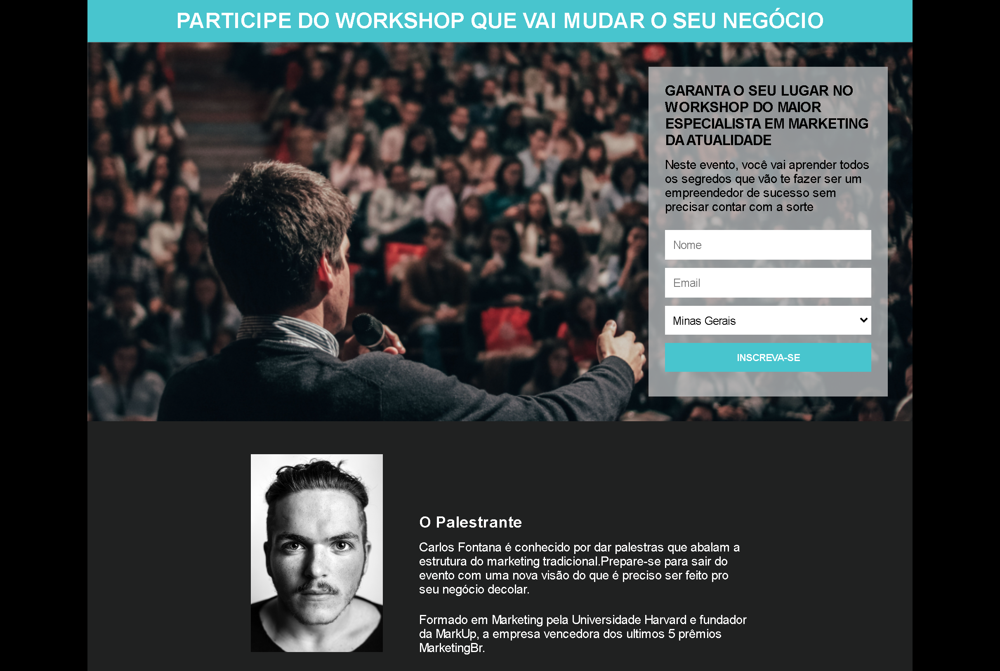

<h1>
    Página De Captura - <a href="https://pag-de-captura.vercel.app/" target="_blank">Clique e veja o Projeto
        Online</a>
</h1>

    Projeto do curso Desenvolvimento Web - Igor Oliveira (Programador BR).

<h2>
    Objetivo:
</h2>

    Colocar em prática meus conhecimentos em HTML5/CSS3/Media Queries e integração do Mail Chimp com o formulário.

<h2>
    Capturas De Tela:
</h2>

<h3>Desktop</h3>

<h3>Mobile</h3>

<h4>
    Obrigado pela visualização do meu projeto.  
    Estou sempre disposto a sugestões de melhorias!!   
    <a href="https://pag-de-captura.vercel.app/" target="_blank">Clique e veja o Projeto Online</a>
</h4>
